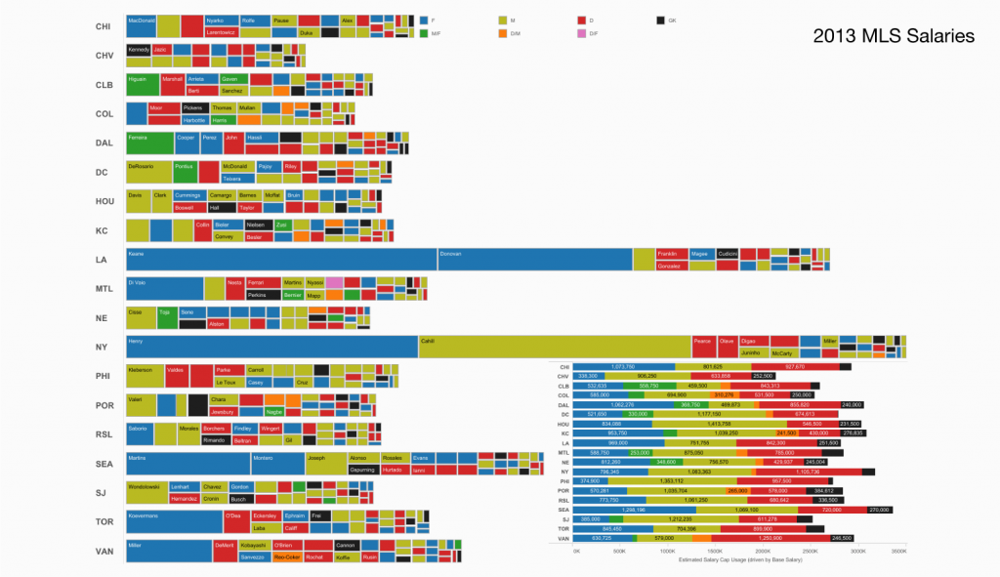
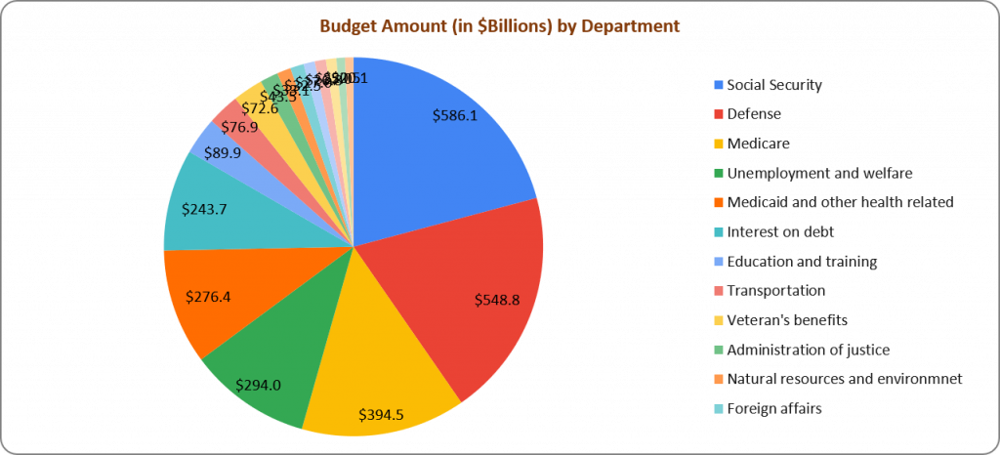
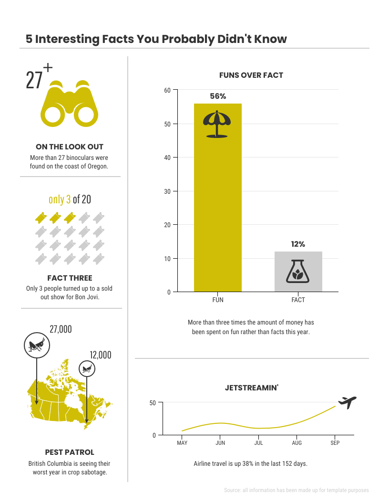
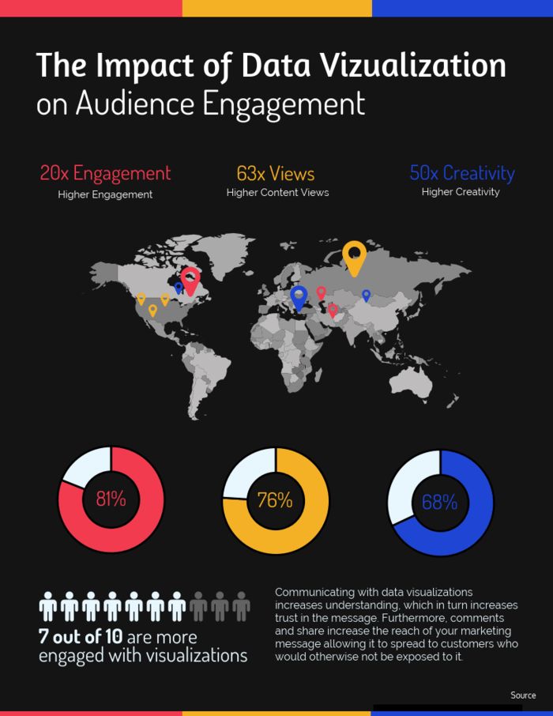

# Contoh Bad Visualization

> Penjelasan :
Visualisasi yang kamu unggah adalah grafik batang yang menampilkan MLS Salaries pada tahun 2013. Berdasarkan prinsip visualisasi data, grafik ini dapat dikategorikan sebagai bad visualization. Berikut alasannya:
1. Kejelasan (Clarity)
Tidak jelas: Banyaknya warna dan blok-blok kecil dengan label teks yang tumpang tindih membuat grafik ini sulit untuk dibaca. Pembaca harus bekerja keras untuk memahami siapa pemainnya dan berapa gaji mereka, terutama untuk blok-blok kecil.
2. Relevansi (Relevance)
Kurang relevan: Meskipun grafik ini mencoba menampilkan banyak informasi (posisi pemain, tim, gaji), pengaturan warna dan blok-blok yang terlalu padat mengurangi relevansi dari data utama, yaitu gaji para pemain.
3. Kesederhanaan (Simplicity)
Terlalu rumit: Terlalu banyak elemen warna dan variasi ukuran membuatnya terlihat terlalu kompleks. Sementara detail posisinya penting, hal ini membuat visualisasi menjadi lebih membingungkan daripada memberikan informasi yang jelas.
4. Ketepatan (Accuracy)
Kurang akurat secara visual: Blok-blok kecil dan jarak yang bervariasi antara elemen-elemen membuatnya sulit untuk segera memahami perbedaan gaji antar pemain. Skala gaji mungkin benar, tetapi presentasi visual tidak membantu menyoroti perbedaan ini dengan efektif.
> sumber gambar : https://glints.com/id/lowongan/kesalahan-data-visualization/

> Penjelasan :
Visualisasi ini adalah pie chart yang menunjukkan Budget Amount (in $Billions) by Department.
1. Kejelasan (Clarity)
Kurang jelas: Ada terlalu banyak kategori yang ditampilkan, sehingga membuat segmen-segmen kecil sulit dibaca. Misalnya, label seperti "Foreign affairs" dan "Administration of justice" sangat kecil dan hampir tidak terlihat.
2. Relevansi (Relevance)
Kurang relevan: Pie chart biasanya lebih cocok untuk membandingkan beberapa kategori besar. Di sini, data dengan jumlah yang sangat kecil (misalnya, di bawah $100 miliar) sulit dibaca dan tidak memberikan perbandingan yang efektif antara segmen.
3. Kesederhanaan (Simplicity)
Tidak sederhana: Terlalu banyak segmen warna yang membingungkan, terutama dengan penggunaan warna yang sangat mirip di beberapa kategori, sehingga sulit bagi mata untuk segera membedakan informasi utama.
4. Ketepatan (Accuracy)
Distorsi dalam proporsi: Pie chart sering kali menyebabkan kesulitan dalam memperkirakan proporsi yang tepat antara kategori, terutama dengan banyaknya kategori kecil. Perbedaan antar segmen besar juga bisa jadi tidak terlihat jelas.
> sumber gambar : https://glints.com/id/lowongan/kesalahan-data-visualization/

# Contoh Good Visualization

> penjelasan : Visualisasi ini menyajikan peningkatan perjalanan udara dan perbandingan pengeluaran untuk hiburan dibandingkan penelitian, dengan pendekatan visual yang ringan dan informatif.
1. Penggunaan ikon yang relevan: Setiap fakta didampingi oleh ikon atau gambar yang relevan dengan informasinya, seperti teropong untuk pengamatan, payung untuk kesenangan, dan grafik pesawat untuk perjalanan udara. Ikon-ikon ini membuat visual lebih menarik dan membantu memvisualisasikan informasi.
2. Warna yang konsisten: Skema warna yang sederhana dengan dominasi warna kuning dan abu-abu memberikan kontras yang baik, membuat informasi lebih mudah diidentifikasi dan dipahami tanpa membingungkan pembaca dengan terlalu banyak warna.
3. Penataan yang rapi: Fakta-fakta diatur dengan baik dalam tata letak yang rapi, memungkinkan pembaca memindai informasi dari kiri ke kanan atau dari atas ke bawah tanpa kesulitan. Setiap bagian visual memiliki cukup ruang sehingga tidak tampak penuh sesak.
4. Penggunaan elemen grafik sederhana: Grafik batang dan garis digunakan untuk menyajikan data numerik, menjaga penyajian data tetap sederhana dan mudah dipahami. Angka-angka dan deskripsi singkat menjelaskan poin utama tanpa harus menambahkan terlalu banyak teks.
> sumber gambar : https://www.affde.com/uploads/article/142016/fJPYDDPUfK2r0vfn.png

 
> penjelasan :
1. Penggunaan warna yang tepat: Warna digunakan untuk membedakan kategori atau informasi penting, seperti perbedaan tingkat engagement, views, dan creativity, serta persentase keterlibatan.
2. Kesederhanaan dan kejelasan: Informasi disampaikan dengan jelas dan padat, tanpa terlalu banyak elemen yang membingungkan. Penggunaan ikon dan grafik pie membantu menyampaikan data secara visual tanpa terlalu banyak teks.
3. Penggunaan ikon dan visual: Visual seperti peta, ikon manusia, dan grafik pie membantu memperjelas informasi dan menarik perhatian, sesuai dengan fungsi visualisasi data untuk membuat informasi lebih mudah dipahami.
4. Konsistensi format: Semua elemen visual disusun secara teratur dengan tema warna yang konsisten, menjaga keterbacaan dan kemudahan interpretasi.
5. > sumber gambar : https://www.affde.com/uploads/article/142016/fJPYDDPUfK2r0vfn.png
